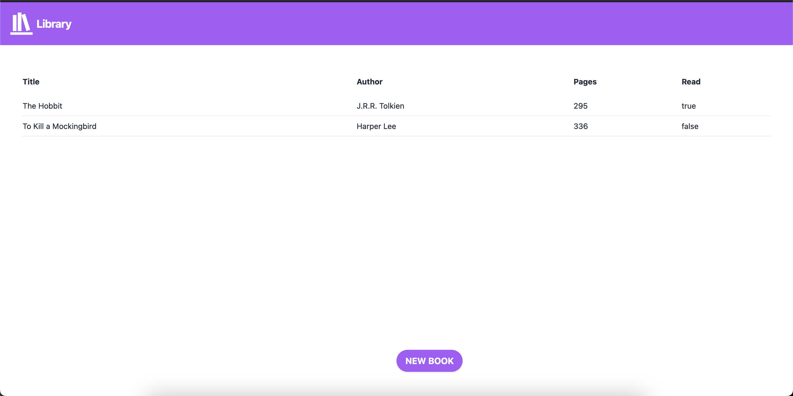
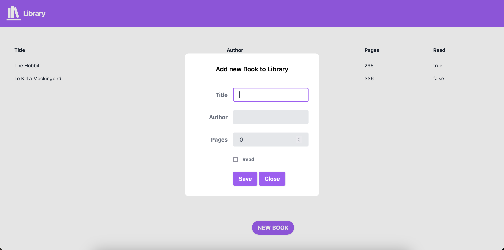

# odin-library

This is a simple web application for managing a personal library. Users can add new books, mark books as read, and view their library.

## Features

- Add new books with title, author, pages, and read status
- Mark books as read
- View the list of books in the library

## Technologies Used

- HTML
- CSS (Tailwind CSS)
- JavaScript

## Installation

1. Clone the repository:
   git clone https://github.com/your-username/my-library.git

2. Open the `index.html` file in your web browser.

## Usage

- Click the "NEW BOOK" button to add a new book to your library.
- Fill in the details of the book and click "Save" to add it to your library.
- Click "Close" to cancel adding a new book.

## Screenshots

